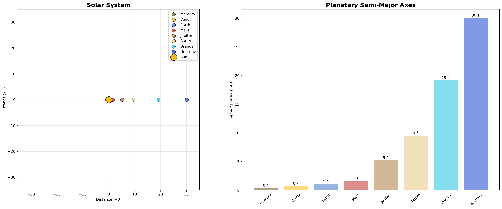
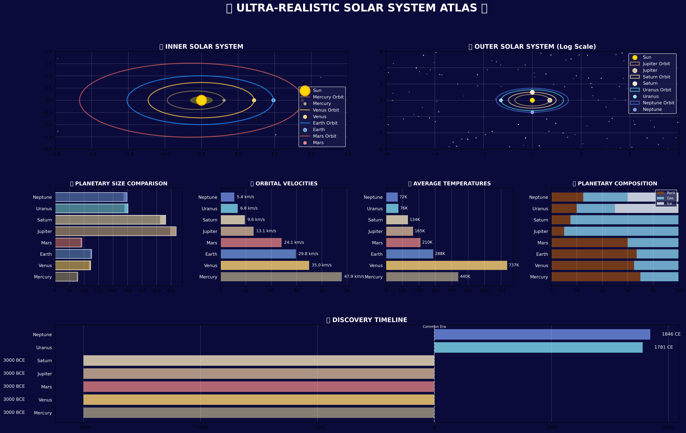
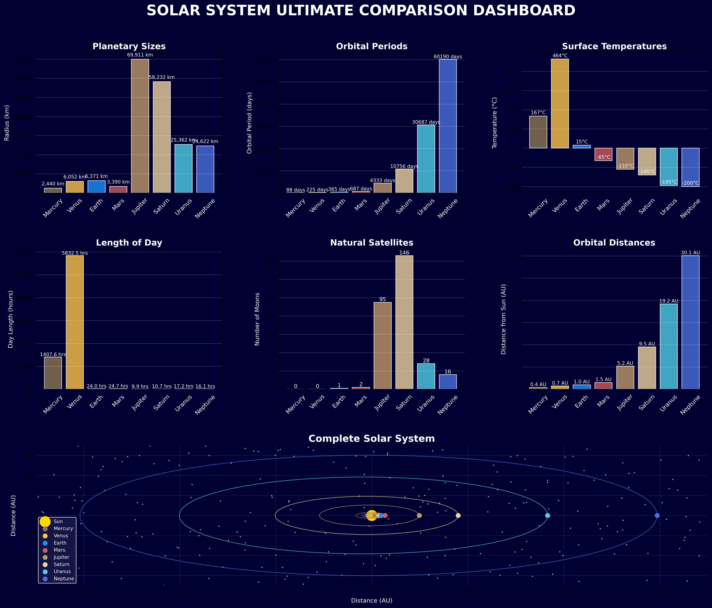
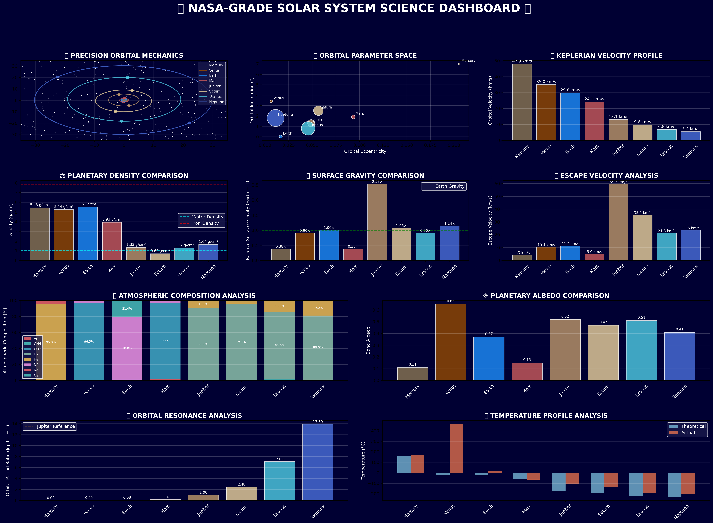
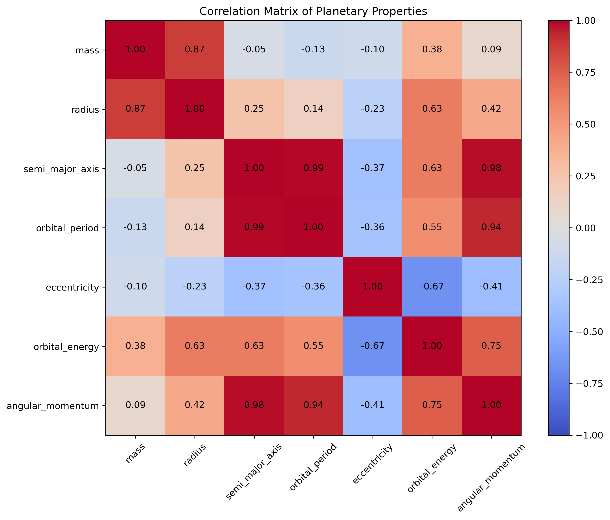
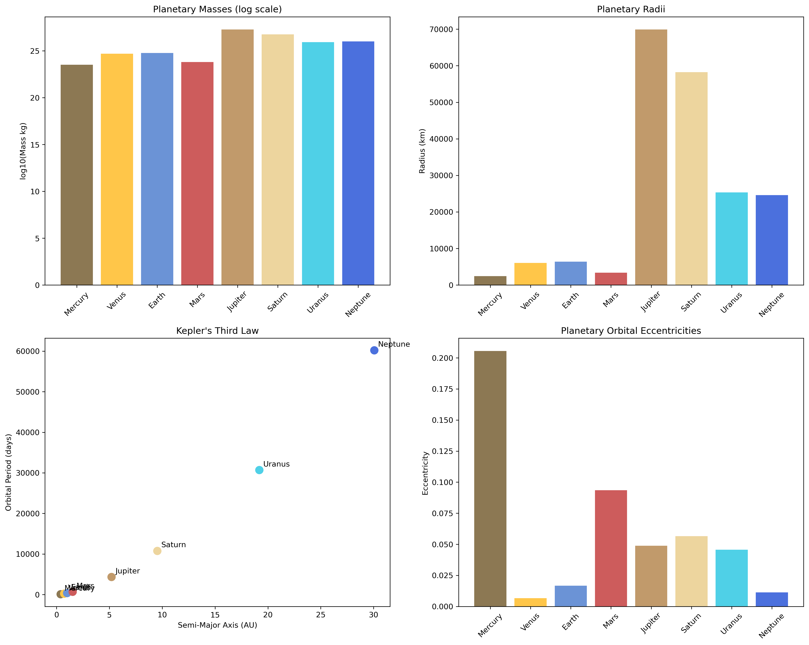

# 🌌 Solar System Simulator Pro



A comprehensive, professional-grade solar system simulation and visualization project built with Python. This project provides accurate astronomical simulations, stunning visualizations, and detailed statistical analysis of our solar system.

## 🚀 Project Overview

**Solar System Simulator Pro** is an advanced educational and scientific tool that simulates planetary motion using real astronomical data and creates beautiful, interactive visualizations. From basic orbital mechanics to NASA-grade scientific analysis, this project offers multiple levels of solar system exploration.

## 📊 Generated Visualizations

### Ultra-Realistic Galactic Overview

*Stunning multi-panel galactic dashboard with professional styling*

### Ultimate Solar System Dashboard

*Comprehensive comparison of planetary properties and characteristics*

### Scientific Dashboards

*Comprehensive 10-panel scientific analysis with precision orbital mechanics*

### Interactive 3D Models

*Interactive 3D visualization with realistic elliptical orbits*

### Planetary Correlation Analysis

*Statistical correlation analysis between planetary properties*

### Comparative Analysis

*Multi-faceted comparison of planetary properties and characteristics*

### Basic Orbital Views

*Classic 2D solar system visualization with orbital paths*

## 🛠️ Features

### 🔬 Scientific Accuracy
- **Precision Orbital Mechanics** using Keplerian elements
- **Real NASA JPL data** for planetary parameters
- **N-body gravitational simulation** with proper physics
- **Orbital resonance analysis** and velocity profiles
- **Atmospheric composition** breakdowns
- **Statistical correlation analysis** between planetary properties

### 🎨 Visualization Types
- **2D Static Plots** with professional styling
- **3D Interactive Models** using Plotly
- **Comparative Dashboards** with multiple analysis panels
- **Realistic Starfields** and space backgrounds
- **NASA-inspired Color Palettes**
- **Correlation heatmaps** for statistical analysis

### 📈 Analysis Capabilities
- **Physical Property Comparisons** (density, gravity, size)
- **Orbital Parameter Analysis** (eccentricity, inclination, periods)
- **Temperature Profiles** and blackbody calculations
- **Escape Velocity** and gravitational analysis
- **Historical Discovery** timelines
- **Property Correlation Analysis** across multiple dimensions

## 🏗️ Project Structure

```
Solar System Simulator Pro/
├── main.py                 # Main application with GUI
├── solar_system.py         # Core simulation engine
├── visualization.py        # Basic plotting functions
├── statistics.py           # Statistical analysis tools
├── nasa_level_visualizations.py    # Professional-grade visuals
├── ultimate_visualizations.py      # Enhanced comparisons
├── ultra_realistic_visualizations.py # Ultra-realistic visuals
├── data/
│   ├── planet_data.json    # Astronomical data
│   └── constants.py        # Physical constants
├── requirements.txt        # Python dependencies
└── README.md              # This file
```

## 🚀 Installation & Setup

### Prerequisites
- Python 3.8+
- pip package manager

### Installation Steps

1. **Clone the repository**
   ```bash
   git clone https://github.com/zafariabbas68/-Solar-System-Simulator-Pro.git
   cd -Solar-System-Simulator-Pro
   ```

2. **Install dependencies**
   ```bash
   pip install -r requirements.txt
   ```

3. **Run the simulation**
   ```bash
   # Basic visualization
   python main.py
   
   # NASA-grade scientific dashboard
   python nasa_level_visualizations.py
   
   # Ultimate comparison dashboard
   python ultimate_visualizations.py
   
   # Ultra-realistic visualizations
   python ultra_realistic_visualizations.py
   ```

### Dependencies
```txt
numpy
matplotlib
plotly
astropy
scipy
pandas
tkinter
```

## 💻 Usage Examples

### Basic GUI Application
```bash
python main.py
```
Launches an interactive GUI with multiple tabs for different visualization types.

### Scientific Analysis
```bash
python nasa_level_visualizations.py
```
Generates professional scientific dashboards suitable for research and education.

### Ultra-Realistic Visualizations
```bash
python ultra_realistic_visualizations.py
```
Creates stunning galactic overviews with professional color schemes.

### Quick Visualization
```bash
python run_visualization.py
```
Creates all basic visualizations automatically.

## 📊 Generated Output Files

After running the simulations, you'll get these professional outputs:

- **`ULTRA_REALISTIC_GALACTIC_OVERVIEW.png`** - Stunning multi-panel galactic dashboard
- **`ULTIMATE_SOLAR_SYSTEM_DASHBOARD.png`** - Enhanced comparison dashboard
- **`NASA_GRADE_SCIENCE_DASHBOARD.png`** - Comprehensive 10-panel scientific analysis
- **`NASA_3D_SOLAR_SYSTEM.html`** - Interactive 3D solar system model
- **`correlation_matrix.png`** - Statistical correlation analysis heatmap
- **`solar_system.png`** - Basic 2D orbital visualization
- **`planetary_comparison.png`** - Multi-property comparison charts
- **`realistic_orbits_2d.png`** - Elliptical orbit visualization
- **`keplers_law.png`** - Verification of Kepler's third law
- **`orbital_energy.png`** - Orbital energy analysis

## 🔬 Scientific Data Sources

This project uses real astronomical data from:
- **NASA Jet Propulsion Laboratory (JPL)**
- **International Astronomical Union (IAU)**
- **NASA Planetary Fact Sheets**
- **Latest astronomical research data**

## 🎯 Educational Applications

### For Students
- Understand orbital mechanics and Kepler's laws
- Visualize planetary scales and distances
- Explore physical properties of celestial bodies
- Learn about atmospheric compositions
- Study statistical correlations between planetary properties

### For Educators
- Create engaging astronomy lessons
- Generate professional teaching materials
- Demonstrate complex astronomical concepts visually
- Provide interactive learning experiences
- Show statistical relationships in planetary science

### For Researchers
- Analyze orbital resonances and patterns
- Study planetary system dynamics
- Verify theoretical calculations with simulations
- Create publication-quality visualizations
- Conduct statistical analysis of planetary properties

## 🌟 Advanced Features

### Realistic Physics
- **Gravitational N-body simulation** using Runge-Kutta methods
- **Precision orbital elements** (semi-major axis, eccentricity, inclination)
- **Keplerian motion** with proper anomaly calculations
- **Energy and angular momentum** conservation

### Professional Visuals
- **Multiple color schemes** for different use cases
- **Scale-accurate representations** (when practical)
- **Interactive 3D models** with rotation and zoom
- **Publication-ready figure formatting**
- **Statistical correlation heatmaps**

### Modular Architecture
- **Extensible class structure** for adding new celestial bodies
- **Configurable simulation parameters**
- **Multiple visualization backends** (Matplotlib, Plotly)
- **Easy data source modification**

## 🤝 Contributing

We welcome contributions! Areas for improvement:

- Adding moons and asteroid belts
- Implementing general relativity corrections
- Creating real-time simulation controls
- Adding exoplanet systems
- Improving performance for large-scale simulations
- Enhancing statistical analysis capabilities

## 📝 License

This project is open source and available under the [MIT License](LICENSE).

## 🙏 Acknowledgments

- NASA Jet Propulsion Laboratory for astronomical data
- The Python scientific computing community
- Contributors to matplotlib and Plotly visualization libraries
- Astronomy educators and researchers worldwide

## 📞 Support

For questions, issues, or contributions:
- Open an issue on GitHub
- Check the documentation in the `/docs` folder
- Review the example scripts in `/examples`

---

## 🚀 Quick Start for GitHub

To set up this project on GitHub:

```bash
git clone https://github.com/zafariabbas68/-Solar-System-Simulator-Pro.git
cd -Solar-System-Simulator-Pro
pip install -r requirements.txt
python nasa_level_visualizations.py
```

**Explore the cosmos with Solar System Simulator Pro!** 🪐✨

*Built with ❤️ for astronomy enthusiasts, educators, and researchers.*
